### the Friendification of Mindfulness — Gamifying a Solution to Insomnia with the Philosophy of Childhood Comfort \(UX Case Study / Manifesto\)

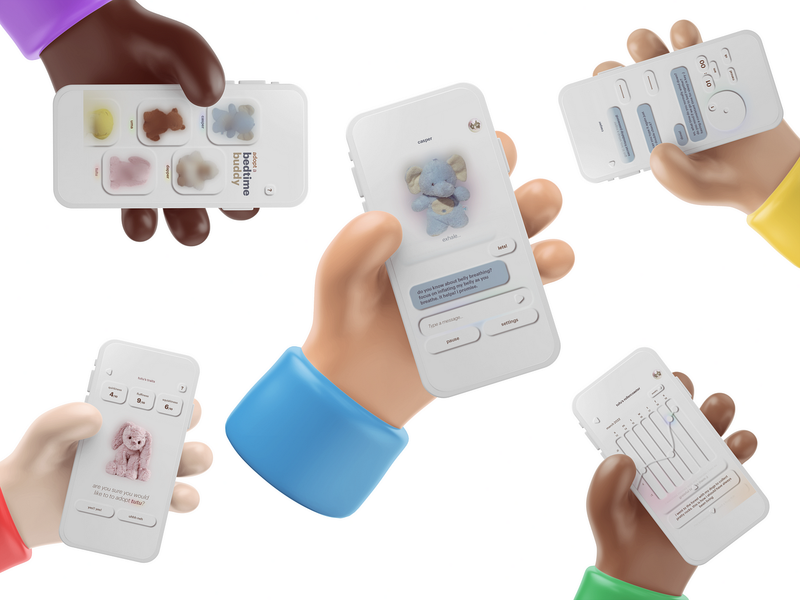

> **Product Overview:** Mindfulness chatbot application with breathing exercises and mood journaling, inspired by Breatherly and Woebot\. 

> **Roles:** UX Researcher, UI/UX Designer
 

> **Tools:** Adobe Illustrator and XD, Figma, Zeplin, Google Forms & Sheets, Maze
 

> **Duration:** 12 weeks 

#### a Can of Worms — the world will remain in a state of desperate dejection until Microsoft Excel is completely genocide\-d\.

Needless to say, we are all miserable\. Users generally seek out mindfulness applications because of this fact\. To put it simply, users of mindfulness apps generally see the world as an asphalt petri dish, and they just desperately Do Not Want To Feel Bad Anymore\. We are on the verge\. We are all collectively about to lose it\. So why, might I ask, do user interfaces refuse to account for this?

Many people around my age often feel user interfaces are cold, corporate, and completely devoid of personality\. For apps like Microsoft Excel it’s not a problem, as the purpose of the application is to make you feel terrible regardless, but with mindfulness applications I’d argue things should be different\.
#### Solution — the Philosophy of “Cute”

I often think to myself “I NEED TO BE CARED FOR RIGHT NOW I NEED IT SO BAD I NEED A LITTLE SQUISHY FLUFFY QUIRKY AIRHEADED LITTLE FACE TO FILL THE VOID IN MY CHEST” and I know I’m not alone\. I wholeheartedly believe there is value and power in what many would describe as “cute\.” It represents an entire philosophy — an innate desire to protect and care for those around us\. It gives us warmth in a world that is often so devoid of it\.

With most user experiences, the UI only functions to take the user directly to the content\. For this project, my goal was to blur the lines between content and user interface\. In this case, the UI will be the content\. That is to say, the method being used to present the main function of the app, is used to aid the user’s problems in of itself\.
#### How it works:

To apply this, I made an Animal Crossing\-esque chatbot the main medium of exploration within the app\. This made the interaction with anything much more personal, friendly, and cute\!

It all starts from the chatbot asking you about your day\. Not only do the responses encourage a form of journaling, it also allows the bot to analyse the emotional context of the words being used in order to pick a breathing exercise to help the user\. The idea is that by addressing the user’s emotions, it can help them to feel comfortable and fall asleep\.

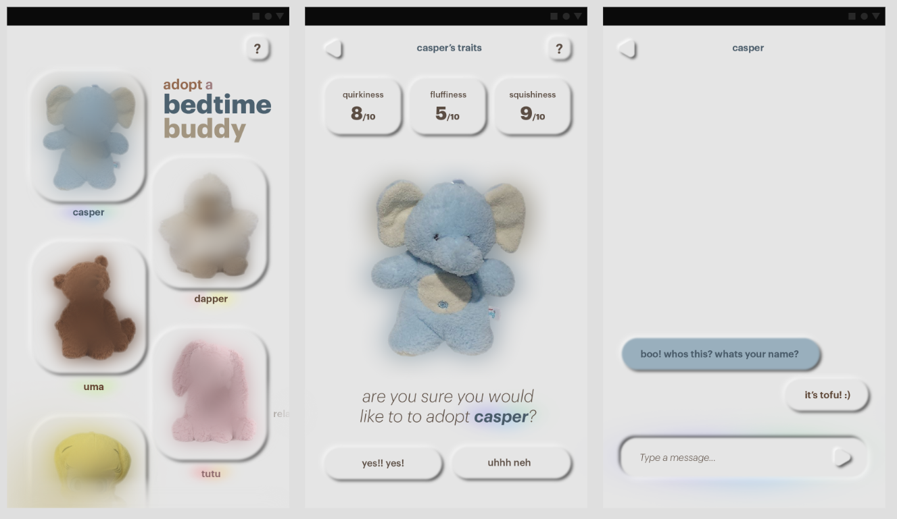

Onboarding

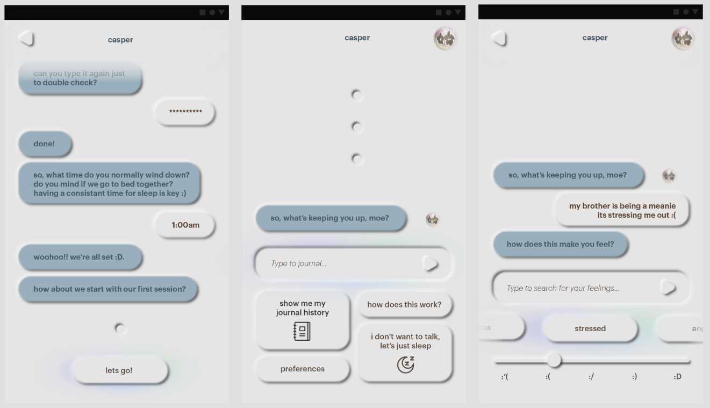

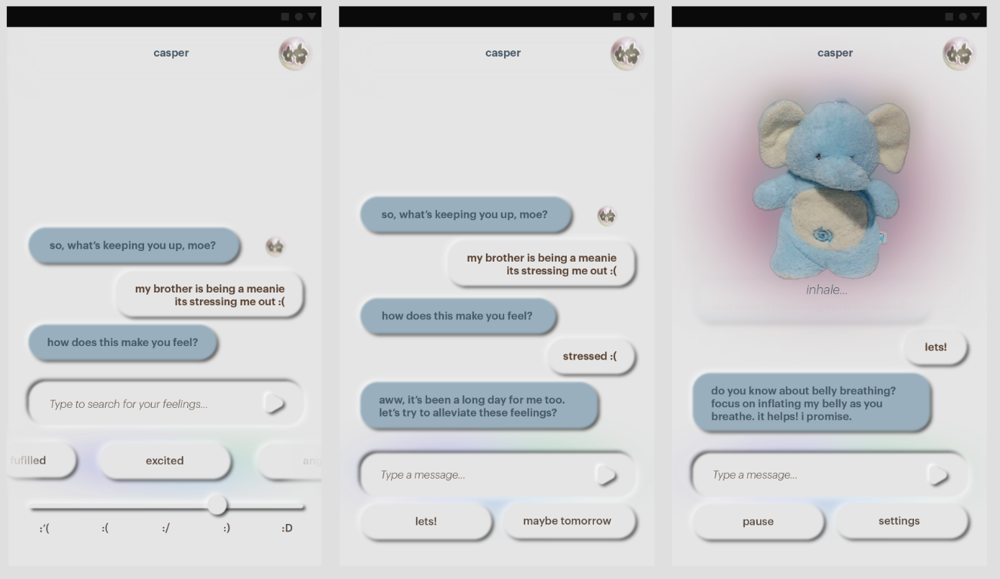

Onboarding to homepage to journaling to breathing

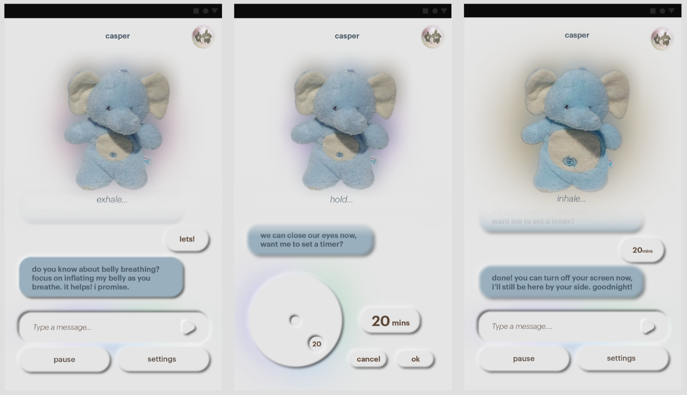

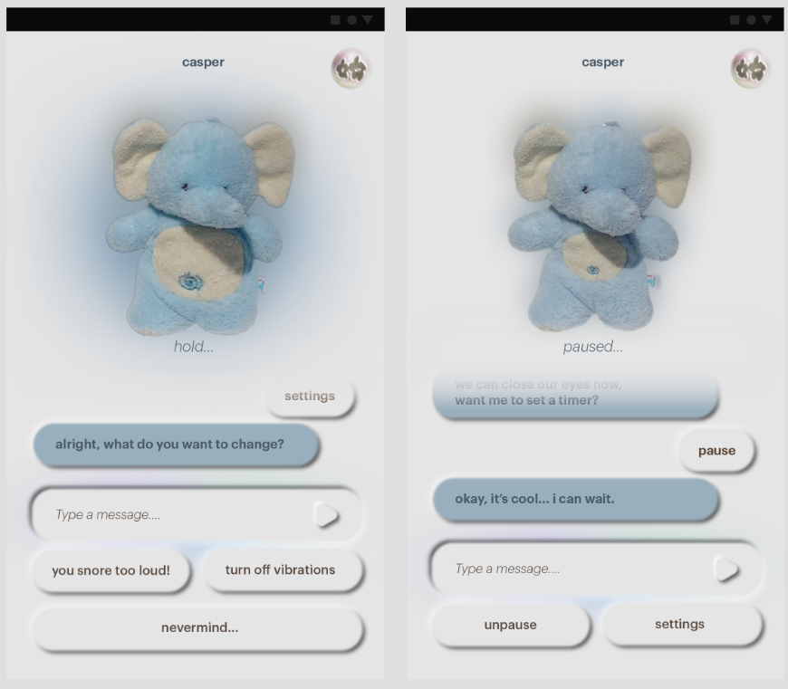

Setting timers and changing settings while breathing

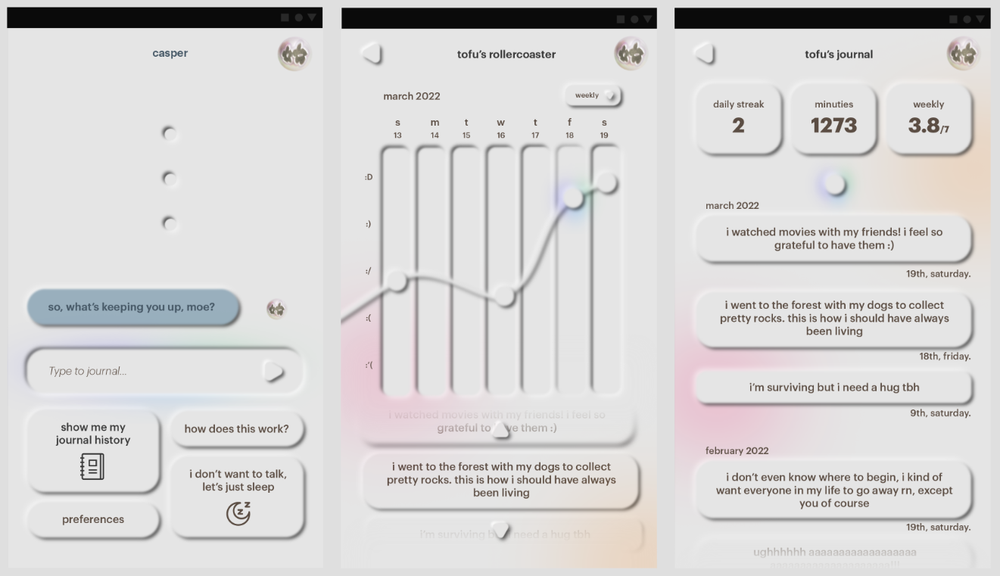

Homepage to journal history pages

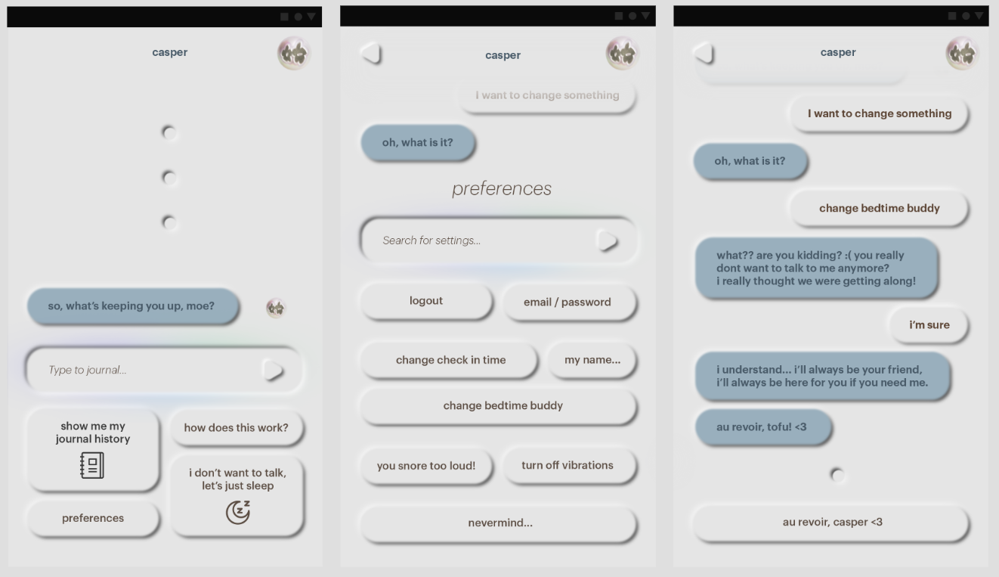

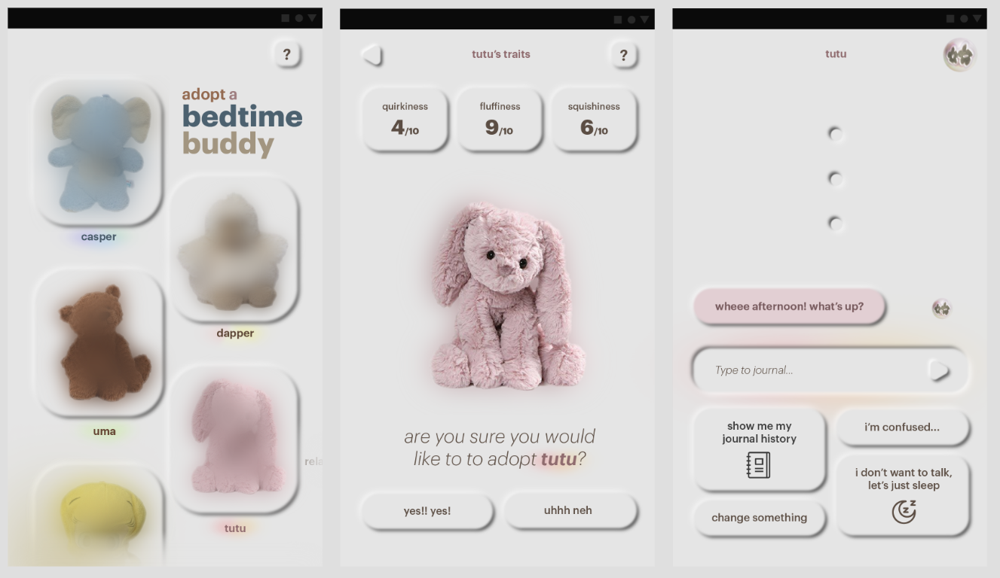

Homepage to settings to changing bedtime buddy
#### Design Process —long and technical

The rest of this article is dedicated to the entire design process and research that has lead to the conclusions reached above\. The fun ends here so feel free to stop reading unless you're an academic masochist\.

> From a bird’s eye view: 

> Research \-\> Concept \-\> Usability \-\> Handover 

### Research Sprint
#### On Breathing exercises and their effects:

Breathing exercises can reduce stress by increasing oxygen exchange, which reduces your blood pressure, slows the heart, and releases any tension held in the abdomen\.

These physical changes also benefit your mental state — helping aid sleep and manage anxiety

](assets/7bf7ee34005/0*FLzgo91H3bakn-Bz)

[https://www\.ncbi\.nlm\.nih\.gov/pmc/articles/PMC5455070/](https://www.ncbi.nlm.nih.gov/pmc/articles/PMC5455070/)
#### Interview

A survey was used to pick out individuals suitable to interview\. Of 17 participants, 3 were chosen for an interview\.

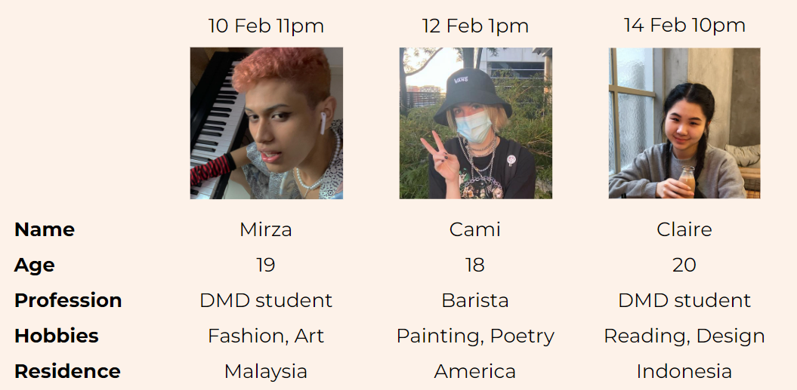

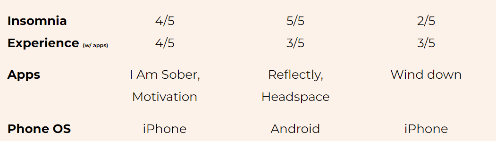

meet the interviewees :D

The interview consisted of 4 parts:
- General \(demographics, background, interests, habits\)
- Engagement \(Awareness & engagement of mindfulness apps\)
- Onboarding \(Possible pain points while using the app\)
- Evaluation \(Feedback for their current solution, possible solutions\)

#### Insights

_All interviewees:_
- Prefer app to choose breathing exercise for them
- Struggles to sleep with meditation narration and prefers vibration mechanic \(it startles them from sleep\)

_Mirza:_
- Prefers interesting dynamic interaction experience
- Likes more casual less “robotic” language
- Appreciates motivating messages

_Cami:_
- Has anxiety related insomnia
- Breathing exercises are her favourite form of meditation
- Hates paywalls

_Claire:_
- App should encourage user to turn off notifications // or block distracting apps
- Audio guided meditation is “too much” of a commitment, and it’s hard to concentrate on them
- Graphics to remind users visualize
- Likes when its simple and doesn’t take too much of her time like guided meditations do

_Of forum participants:_
- **64\.7%** were 18–21
- **41\.2%** had experienced insomnia almost everyday the past month
- **35\.4%** had experience with mindfulness apps previously
- **55\.6%** used the apps to aid sleep and stress
- **50\.0%** reported mood reflection, mindful breathing, and visualization to be their favourite techniques
- **76\.5%** have never used a dedicated app for breathing exercises
- **82\.4%** needs help picking a specific breathing exercise
- **64\.3%** prefer the app to help them pick one by asking questions about their situation
- **54\.5%** of those that have used guided meditation struggle to sleep to voice narrations and would prefer a different mechanic

With these insights, a persona, journey, problem, and opportunity was created\.
#### Validated Persona, Journey, Problem and Opportunity

_Profile:_ 
19, Student, lives with parents
⅘ Digital Savviness
5/5 English literacy 
Early Majority adopters

_Behaviours:_ 
Artsy slightly pretentious but fun
Creative personality
Struggles with emotional regulation and insomnia
Sleeps through the day

_Pain points:_ 
Wants casual and personal user experience for emotional guidance
Gets woken up by audio when trying to sleep with a guided meditation
Wants something simple and easy to use without much time commitment

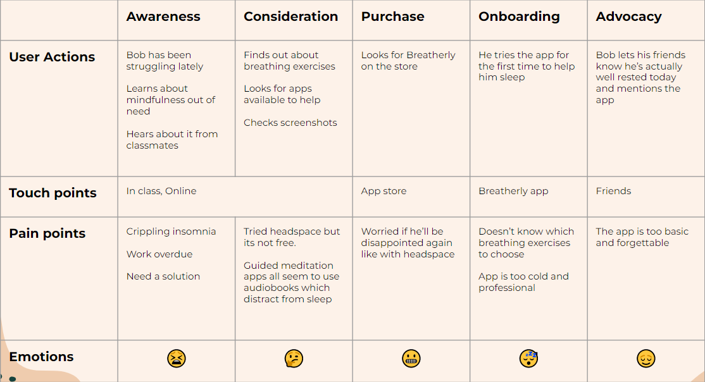

Journey

**For** struggling insomniacs
**Who** struggles to sleep with narrations and wants a more dynamic user experience
**Our** product is a mindfulness guiding app
**That** provides breathing exercises, a personalized and fun user experience and mindfulness practices \(watching thoughts, emotional awareness, etc\)
**Unlike** meditation apps
**Our solution** is more personal and flexible, uses vibration instead of audio as to not interrupt sleep

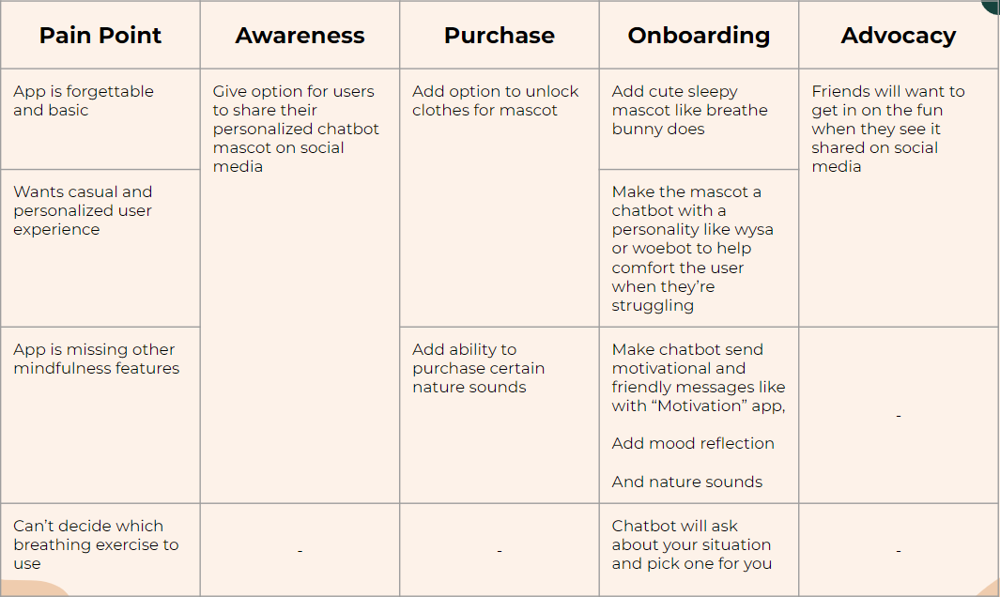

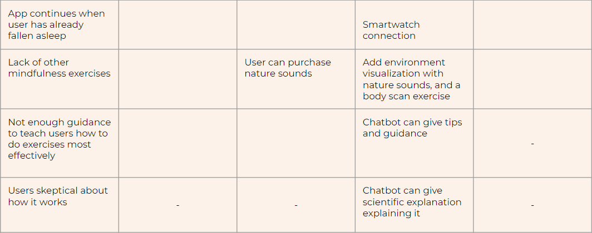

Opportunities

Then, a competitor analysis board was made to compare my main app inspiration, Breatherly, to other mindfulness apps\.
#### Competitor analysis

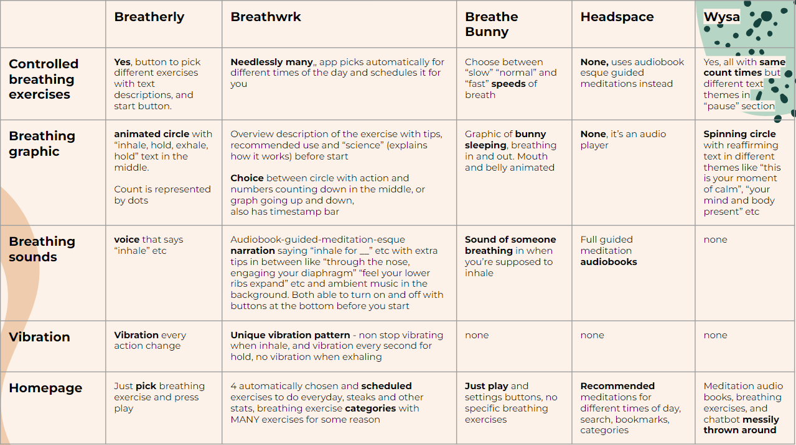

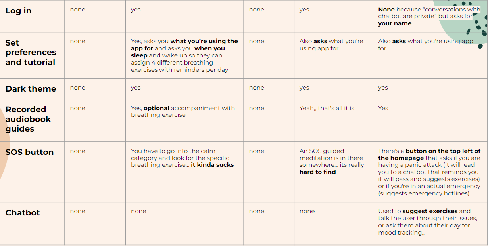

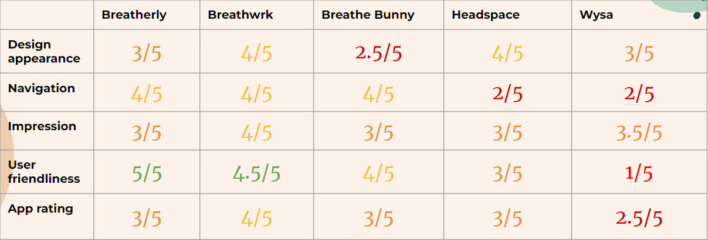

#### **Breathwrk**

Breathing exercise app structured like a traditional audiobook guided meditation app, like a bit of both

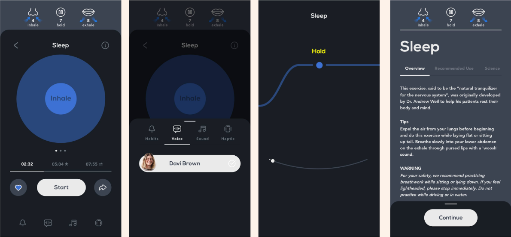

_Pros:_
- Clean interface design
- Automatically chosen exercises
- Nice statistic tracking
- Detailed descriptions of exercises
- Individually recorded narrations with most exercises

_Cons:_
- Needlessly too many exercises
- Paywall behind literally everything
- Feels overwhelming and overkill
- Bloated\. Needs to be more simple

Seems to me this app pumps itself with exercises with minute details just to entice users to pay for something\. It’s really blatant and it really grosses me out\. Their breathing exercise interface is very professional looking and clean though, it’s okay\.
#### Breathe Bunny

Simple breathing exercise app with a cute bunny graphic and sounds to help user relax

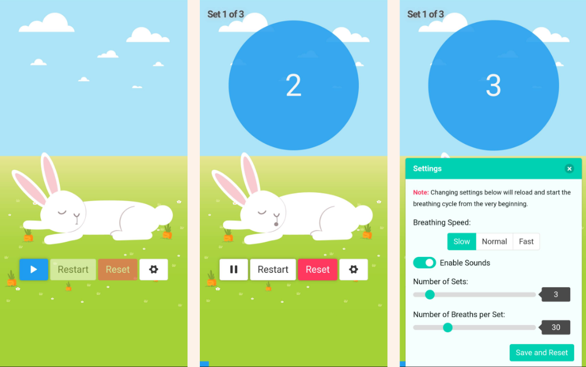

_Pros:_
- Cute bunny and landscape to breathe with
- Very simple user experience, no bloat at all, no log in, no paywall\.
- I like that you can hear the rabbit breathing to accompany the exercise

_Cons:_
- Breathing exercises are way too fast on even the slowest setting
- Only three exercise settings
- Concept is cute but the all the graphics and buttons look cheap
- No vibration feedback

I love the mascot idea, it makes me feel like I’m sleeping alongside someone and I just have to follow them\. It’s comforting and cute, but the app and graphics need work
#### Headspace

Popular traditional audiobook meditation app

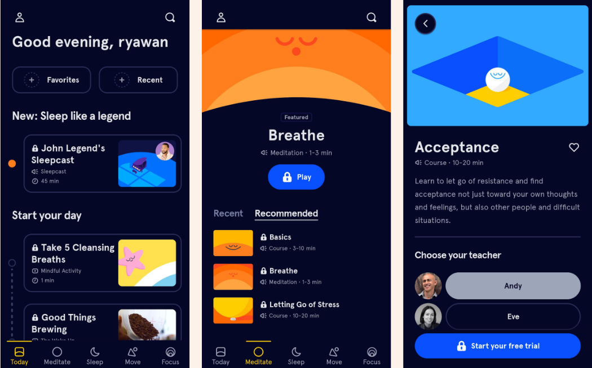

Pros:
- Nice graphics and art style
- They have dark mode on by default

_Cons:_
- Need to pay for everything
- So bloated and messy
- Can’t find anything on the app
- Feels unorganized and headache inducing
- Really confusing categories
- They only have audio narrations

This app used to be great when i first used it 5 or so years ago\. Now it is bloated and the sight of it kind of makes me want to puke\. It’s borderline unusable, I don’t have the patience to navigate so many meaningless categories\.
#### Wysa

A big messy mix of everything, breathing exercises, affirmations from a chatbot, guided meditation audiobooks\. Its really messy

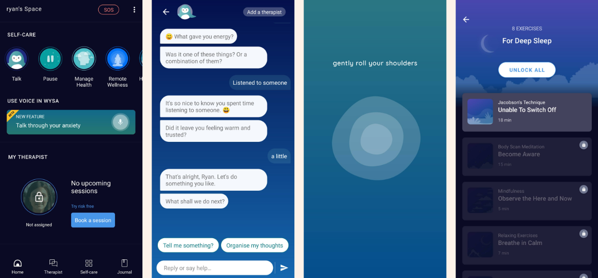

_Pros:_
- Chatbot idea is intuitive and comforting
- Cute and quick “take a deep breath, you are loved” screen every time you open the app
- The mascot is kind of cute
- Chatbot records your mood in “journal” tab

_Cons:_
- UI outside of the chatbot feels all over the place
- Graphics look cheap and ugly
- Chatbot is slow
- Everything feels clunky
- Intrusive paid options
- Messy and bloated
- The app feels like it’s having an identity crisis
- Wish there was more focus on mascot and chatbox

I hate the interface and how messy it is but I think the chatbot feature is a good idea to explore\. It helps make the user experience feel much less mechanical and more personal
#### Woebot

It’s what i wish the Wysa interface was\. The whole UI is centred around a chatbot that helps you choose exercises and asks you about your day\. It’s great\.

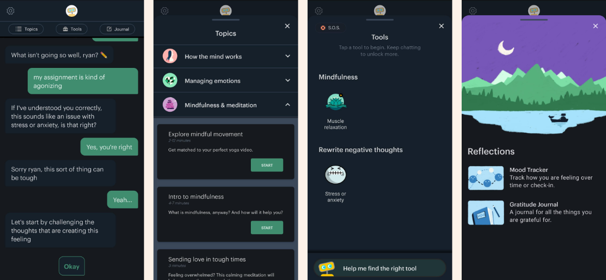

_Pros:_
- Really fun to talk to, fun app to use in general
- Comforting bot actually helps with cognitive behavioural therapy
- Gives good advice, makes me feel better
- Can help with many things
- Simple, clean and user\-friendly interface
- Easy to use taskbar to navigate features of the app while still making use of familiar chatting mechanic
- He randomly checks up on you and records your mood
- He can do SO MANY things — gratitude journaling, cognitive behavioural therapy, meditation, etc

_Cons:_
- Maybe too many features
- I wish the videos and audio played in the chat instead of having to open it separately\.

I love him\. The app takes on a very friendly, casual persona that’s fun to use and simple to navigate\. It’s probably the best app on this list which is why I had to include it here\.
#### Appendix
- _Interviews;_ [with Cami](https://drive.google.com/file/d/16_Nhc8lhwm3V6-9s7_Ty3vpEtyTygBBU/view?usp=sharing) ; [with Mirza](https://drive.google.com/file/d/13lE6y78X57i5MH8MbAI0LBykC7Pg-5n1/view?resourcekey) ; [with Claire](https://drive.google.com/file/d/1AKxeg3WCmdJIArT4lO_2D2eXBSwJLpcN) \.
- [Survey Form](https://forms.gle/zAGb5T5p6iBazYHj8)
- [Research Sprint Slides](https://docs.google.com/presentation/d/1LAe4z-POCvFihQHa_DWEbBMr_SWrNr83CfvrPj98cXQ/edit?usp=sharing)

### Concept Sprint

As a base of the project, the app I chose for reference was Breatherly\. It is an extremely minimalistic app with little to no features\. This meant analysis of it was minimal, but the space to fill in the gaps was huge\.

Before deciding on the features to add, Jakob Nielson’s Heuristics Analysis was used to find a UX scorecard for Breatherly\. Observe:

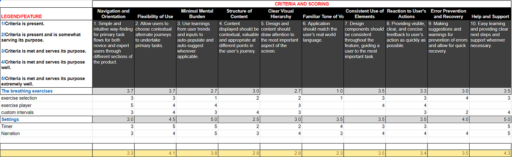

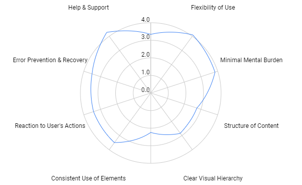

Breatherly scored a 3\.4 on average

While the app was great at minimizing the mental burden by being extremely simple, the structure of content is lacking\. There is very little functionality in general\. This makes Help & support and error prevention virtually disposable\.

**What works — Minimal mental burden\.** App has very little mental burden due to how simple it is to use\. It has very basic functions

**What doesn't — Navigation and structure of content\.** The placement of certain settings and preferences are not intuitive
#### Feature Prioritization

Ideas for features were categorized to determine which were worth focusing on most\.

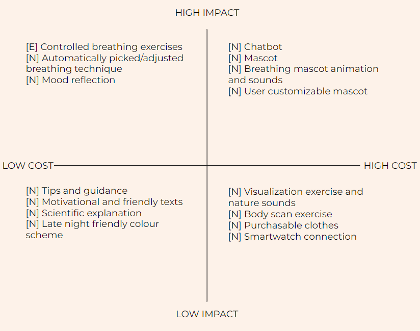

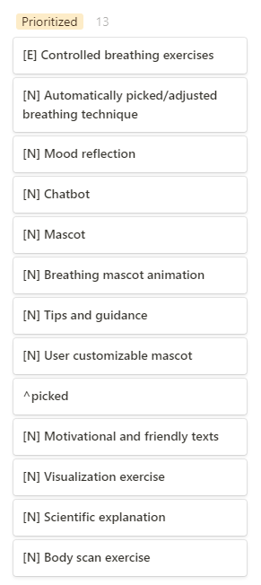

Product Prioritization Framework

After I knew which features to focus on, a sitemap plan was made\.

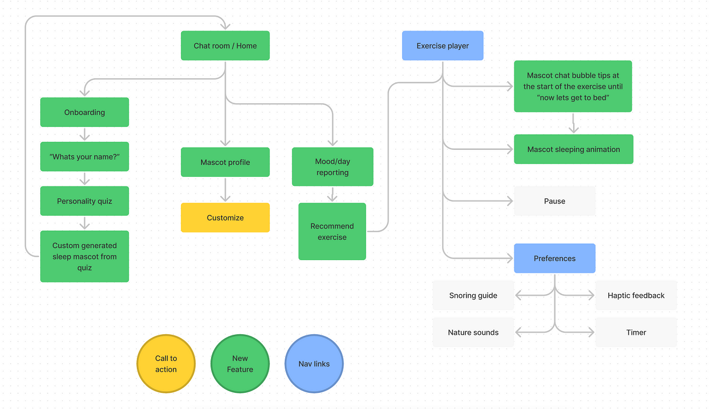

Sitemap with new features

This consisted of:

**A Chatbot** — To help track user’s mood and automatically pick an exercise accordingly
- Asks about your day
- Mood journal of previous inputs
- Automatically picks an exercise based on how the user responds

**A Mascot** — Makes the chatbot interaction much more cozy, casual and motivating\.
- User picked mascot
- Breathes with you during the exercise \(like Breathe Bunny\)

#### Product Outlook Deck and Concept Testing

To test the concept, a basic product wireframe was made for users to test:

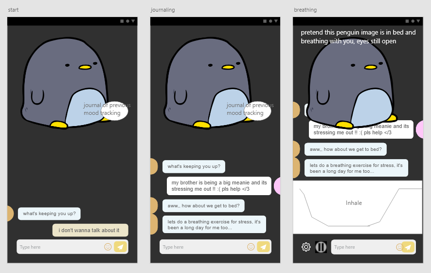

Wireframe prototype

In short, I found that the users:
- Prefers app to choose breathing exercise for them
- Struggles to sleep with meditation narration and prefers vibration mechanic \(it startles them from sleep\)
- Prefers interesting dynamic interaction experience
- Likes more casual less “robotic” language
- Appreciates motivating messages
- Has anxiety related insomnia
- Breathing exercises are her favourite form of meditation
- Hates paywalls
- App should encourage user to turn off notifications // or block distracting apps
- Audio guided meditation is “too much” of a commitment, and it’s hard to concentrate on them
- Graphics to remind users visualize
- Likes when its simple and doesn’t take too much of her time like guided meditations do

Their favourite aspects of the testing was:
- The mascot
- It interaction was simple
- Feet like talking to a friend
- Comforting, good vibe
- Cute language
- Functional and interactive

And their least were:
- Inhale diagram should be with the mascot illustration
- Response to the users answers could have more flavour
- Can make users lonelier if it doesn’t feel organic enough

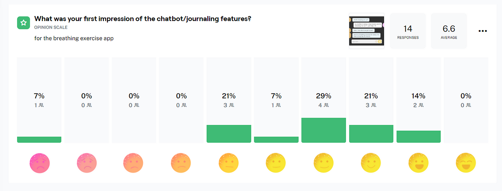

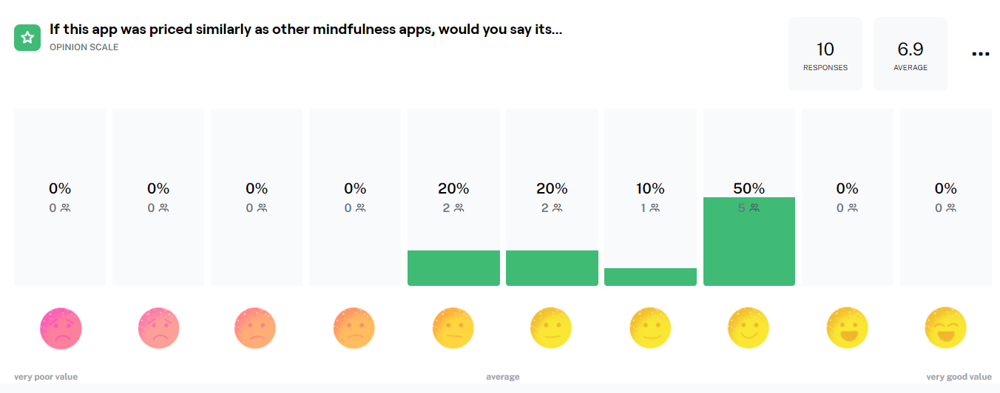

Overall impression

Overall, users were generally thought the app was of good value, 100% thought it was average or better value\. Because:
- It’s more organic feeling because of the bot
- Similar level of benefits to other apps
- “I personally am not interested in mindfulness apps”

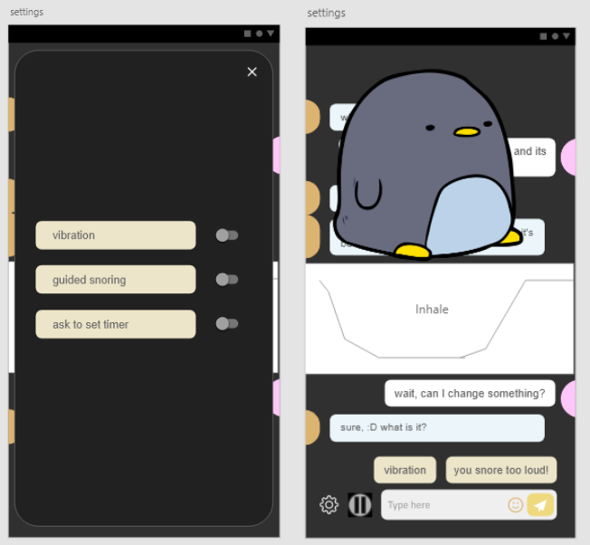

Layouts A \(left\) and B \(right\)

Different menus were also tested\. 60% preferred talking to the chatbot to change settings while 40% preferred using a traditional settings menu\. This was because they feel that; the chatbot settings layout is more human, less menus, feels more personal and is friendlier; the menu layout is faster, less frustrating\.

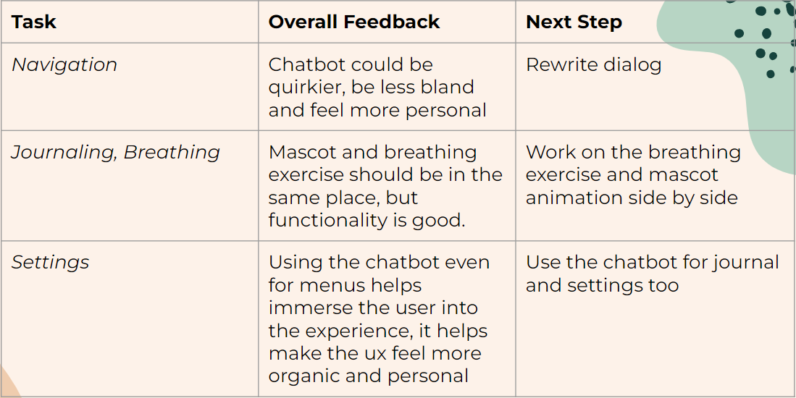

Findings summary
#### Appendix

XD Prototype with; [layout A](https://xd.adobe.com/view/8be714e7-2f75-453e-8455-a6bc47f53ba7-deb4/) ; [layout B](https://xd.adobe.com/view/d6012d22-f181-41cc-9c76-10d702c86823-8352/) \.

[Survey](https://t.maze.co/79671584) and [the results](https://app.maze.co/projects/79662435/mazes/79671584/results)

[UX Audit of Breatherly](https://docs.google.com/spreadsheets/d/1B_F6UdvJ2hqgbYfbMXa4VPMwPGXunsMKv7M5gR-W8iM/edit?usp=sharing)

Slides for the [Concept Sprint](https://docs.google.com/presentation/d/1zxRBbgd4ray9MYfmbdvkI7jxNxtxtMNyusq3tpPQ4OQ/edit?usp=sharing) and [Product Outlook Deck](https://docs.google.com/presentation/d/1IxhdPmH1Wp6msMX6yjJToIk3kdLYW59DN3VuEoqxGiQ/edit?usp=sharing)
### Usability Sprint
#### Moodboard

For the moodboard, I was generally looking for ways I could create a “soft” look, and I envisioned the breathing aspect of the app as a colourful aura\.

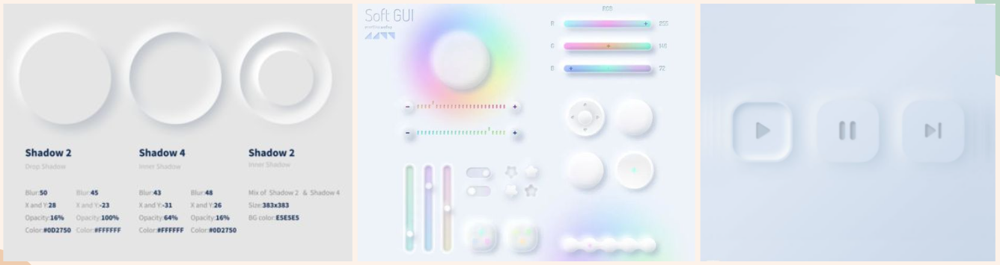

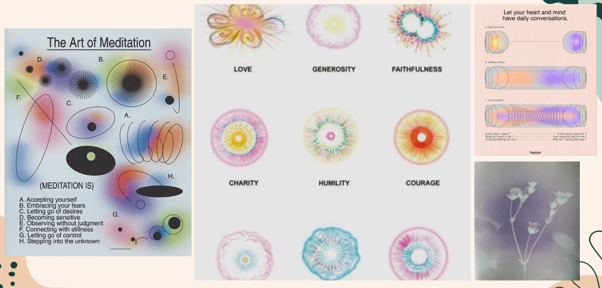

Neomorphic Buttons

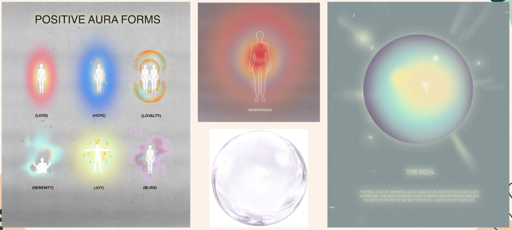

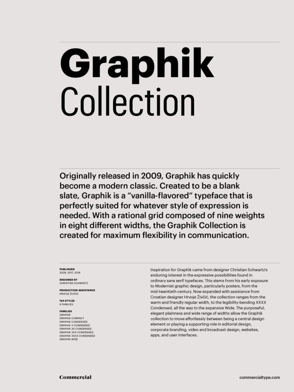

Aura to represent breath
#### User Flow

The first few iterations of user flow consisted of the basic features\. Many more have been added since then \(new flows are shown shown at the start of the article\) \.

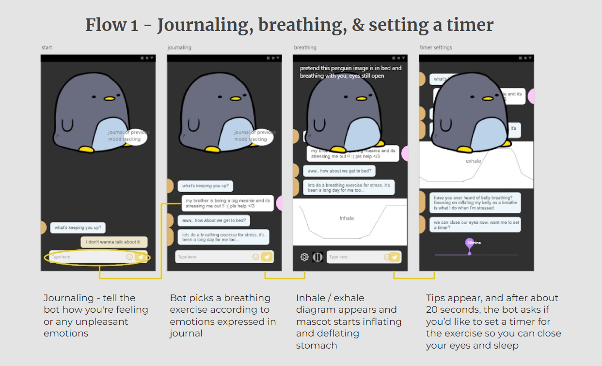

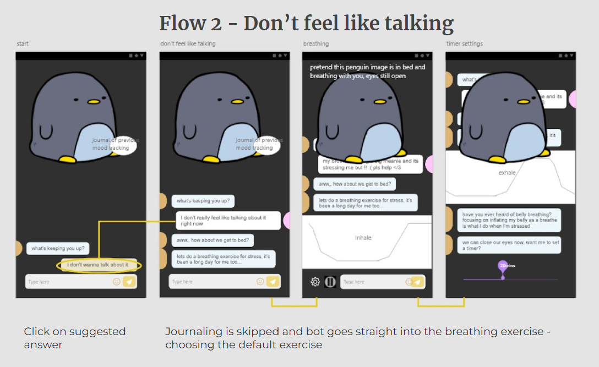

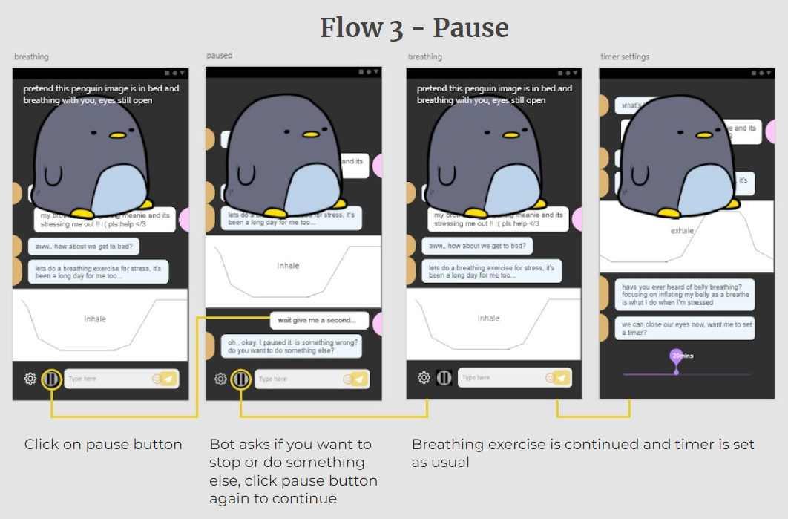

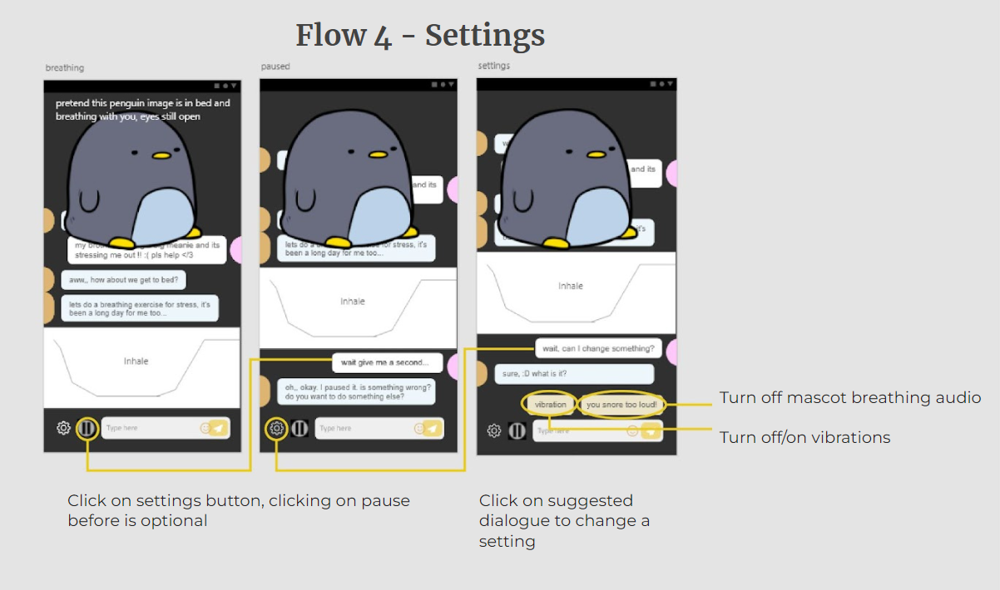

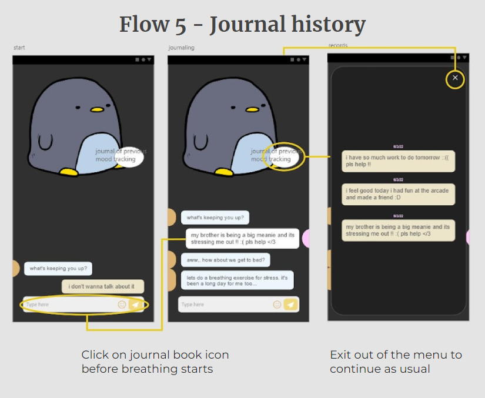

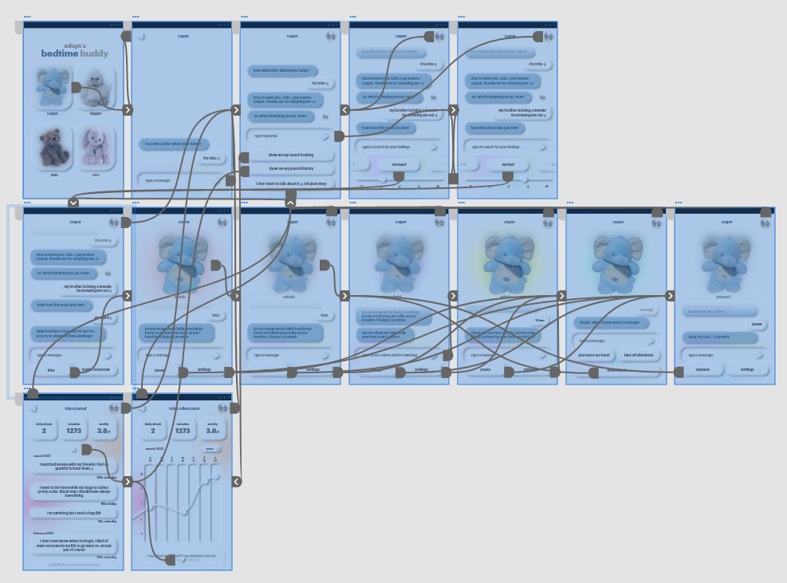

Flow applied to the prototype used for the final testing
#### Final Usability Testing

For the last testing another XD prototype was made\. In total there were 32 unmonitored participants that took part\.

_What they like_
- “ cute” “calming” “unconventional” “soft” “pleasing” UI design
- They felt the design was comforting and relaxing
- Intuitive and simple user experience, “easy to get through”
- Plushies are comfy and they can see themselves appreciating the dialog after a difficult day
- Unique and interesting idea

_What they don’t_
- Adobe XD limitations
- Amount of text can be overwhelming
- Low\-contrast and blurriness for the “soft” aesthetic can be jarring to look at

The users were asked to perform certain tasks within the XD prototype\.
#### Task 1 — Basic functionality, journaling and breathing

_scenario:_ it’s bedtime and you need help going to bed so you download bedtime buddy\.

_task:_
1. adopt casper
2. start journaling, tell casper you are stressed
3. then start a breathing exercise \(the glowing and plushie is supposed to be animated as you breathe, but for this prototype you just have to click on the plushie for the screens to change…\. youre going to have to use your imagination here lol\)
4. set a timer

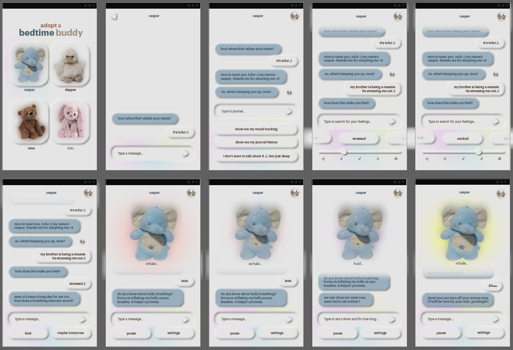

**41\.2% direct success**

**58\.8% indirect success**

**0% gave up**

_Thoughts while doing this task:_
- Audio feedback for buttons would be cool
- It’s cute
- Not clear how to set timer length
- Its a little too soft
- Home button unclear
- I like how they aren’t forced to talk about their day

#### Task 2 — explore journal and mood tracking history

_task:_
1. go to the homepage \(pearl button on the top right\)
2. ask casper to show you your journaling or mood tracking history

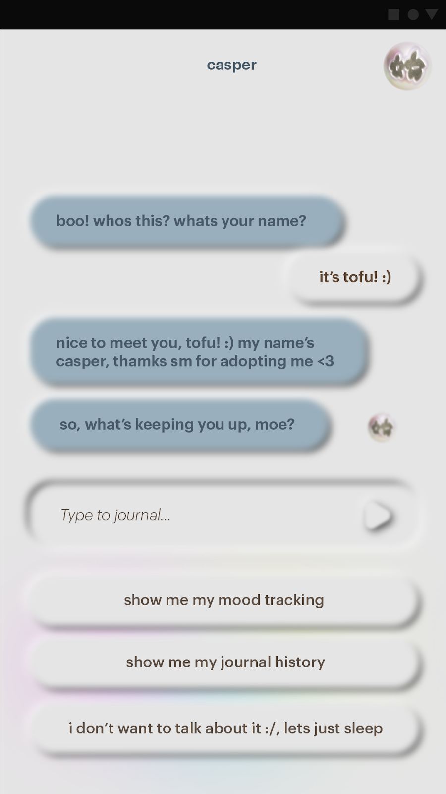

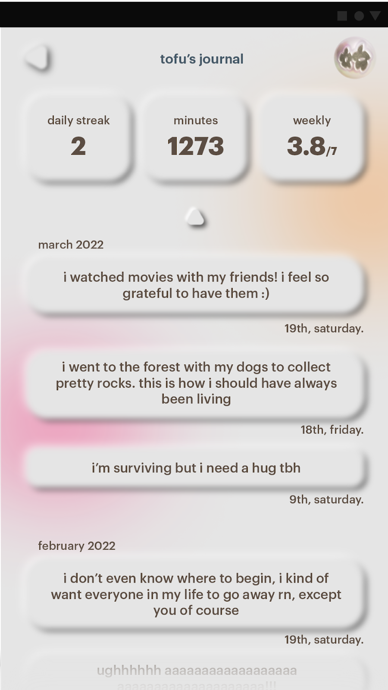

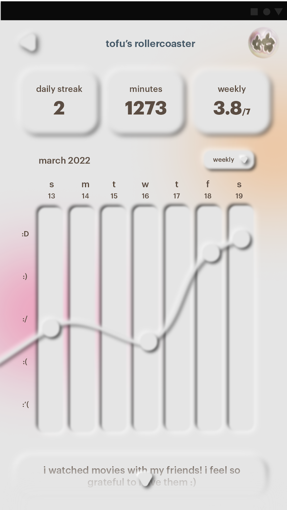

**94\.7% direct success**

**5\.3% indirect success**

**0% gave up**

_Thoughts while doing this task:_
- It’s really simple
- I like these features
- Didn’t notice the arrow button took them to and from the journal / mood tracking

#### Task 3 — explore the settings menu and pause function during breathing exercise

_task:_
1. start a breathing exercise \(you can skip the journaling\)
2. change a setting
3. try pausing

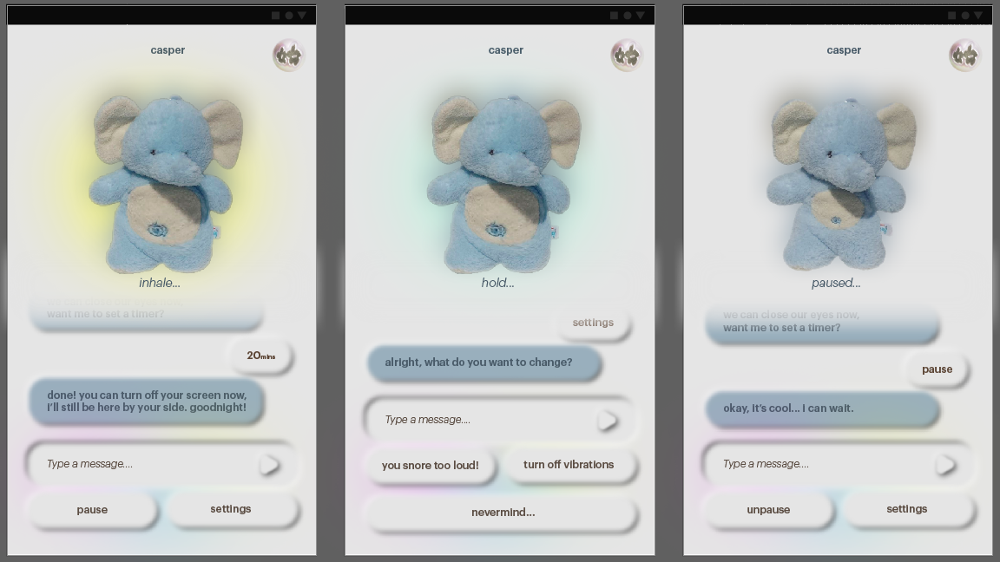

**73\.7% direct success**

**21\.1% indirect success**

**5\.3% gave up**

_Thoughts while doing this task:_
- Yep, that was easy
- I like Casper\. So patient…
- Can’t tell if the settings did anything \(they didn't… It’s a prototype\. \)

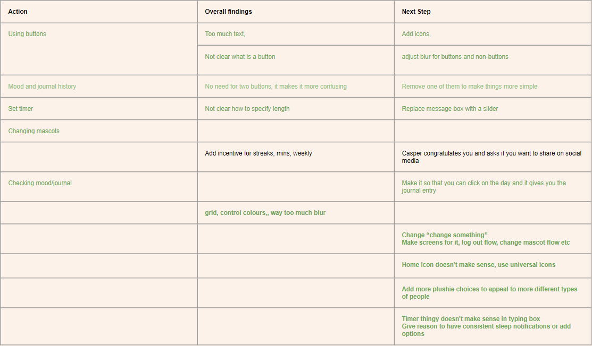

Action plan from findings
#### Final Hi Fidelity Screens \(original version\)

The ones shown below is the original of the final prototype\. The alternative version is displayed below to demonstrate the final flow, it uses a pearl rather than a generic home button\. I personally prefer the pearl but the home button is more functional\.

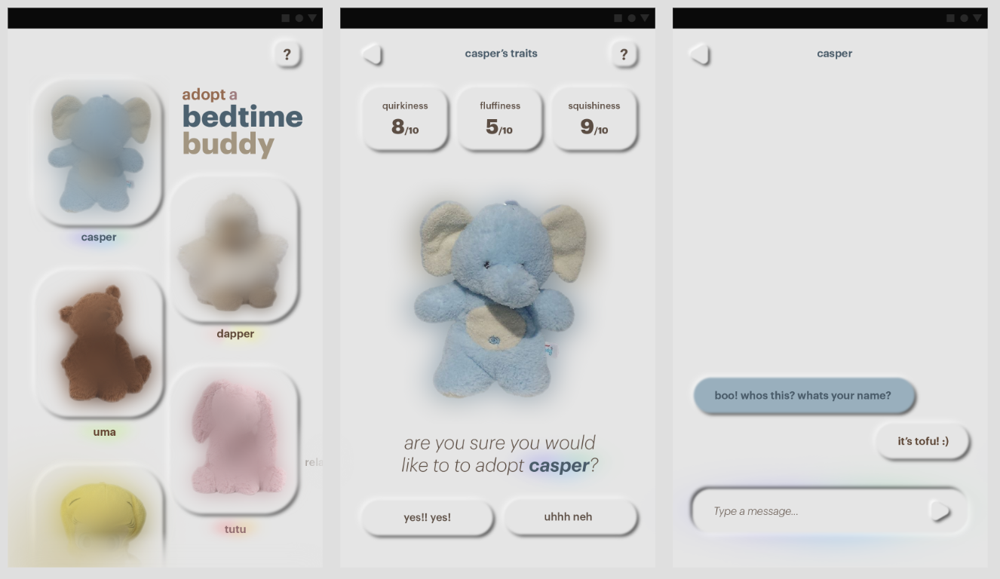

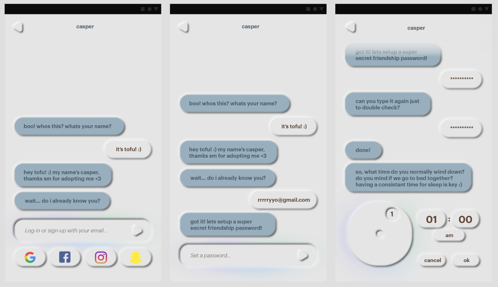


#### Final Flow \(using alternative pearl version\)

Onboarding

Onboarding to homepage to journaling to breathing

Setting timers and changing settings while breathing

Homepage to journal history pages

Homepage to settings to changing bedtime buddy
#### Appendix

[The Final XD Prototype](https://xd.adobe.com/view/e549c98f-2c06-46f8-9c9a-061bf7914587-b01a/?fullscreen&hints=off)

[Survey Form](https://forms.gle/74AsJPTTEdDYLuZC7)

[Usability Sprint slides](https://docs.google.com/presentation/d/1hcnQIhcvQfTnTpEOJF7PQm0LUMHpJAdt8XaopRVDOoM/edit?usp=sharing) \(featuring all iterations of the design process\)
### Handover Sprint
#### Style guide

The purpose of a style guide is to help ensure consistency of a design as the project is continued by different designers\.


#### Mockup:

#### Appendix:

[Handover Sprint slides](https://docs.google.com/presentation/d/1LguG-k9Qf-jHOGhCSFTCjbSNXu1dVZNdGqfbiCUKe5g/edit?usp=sharing)

[Zeplin](https://zpl.io/09lPAxR)
#### Manifesto Finale — you can’t have your cake and eat it too

In the end, my entire view of UIUX was found to be completely backwards\. Expression and art over design, it’s one or the other\. These things are fundamentally at war with each other\. You can’t simultaneously defy expectations and stay as efficient & functional as possible, just as you can’t have your cake and eat it too\. Sacrifices have to be made\. What I ended up with is the anti\-UI, in this regard, I think I may have made a mistake\.

My insistence to create something unique was my biggest drawback\. With a user interface, users want something as familiar and simple as possible\. A chatbot, is not what people are used to using\. Its different, and in this context that is a very bad thing\. Sometimes the only appropriate way to do something is to do it the way everyone else is doing it\.

If I were to do this again I would use a traditional interface system rather than cramming everything in the chatbot interaction, as it made the flow of the interface much more unconventional\. The aura idea had it’s flaws too\. It was difficult to control the colours properly when the idea was for the hue to be animated\. The grey background often made this problem even worse, but it was necessary for the neomorphism to be visible and it contributed to the soft overall look\.

I personally still love what I have created, but to create according to your own ideals is detrimental in UIUX\.

If you got this far down, just for fun, you can explore the prototype used for the last user testing [here](https://xd.adobe.com/view/e549c98f-2c06-46f8-9c9a-061bf7914587-b01a/?fullscreen&hints=off) \. It’s very outdated and is way jankier than the final design but it’s still fun to play around with :\)

For this last bit, I‘d like to thank everyone that participated in any one of the 3 surveys, especially interviewees Cami, Mirza, and Claire\. Thank you\!

_[Post](https://ryaen.medium.com/the-friendification-of-mindfulness-gamifying-a-solution-to-insomnia-with-the-philosophy-of-7bf7ee34005) converted from Medium by [ZMediumToMarkdown](https://github.com/ZhgChgLi/ZMediumToMarkdown)._
