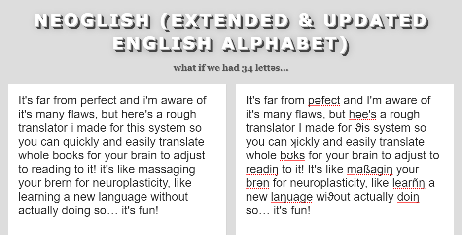
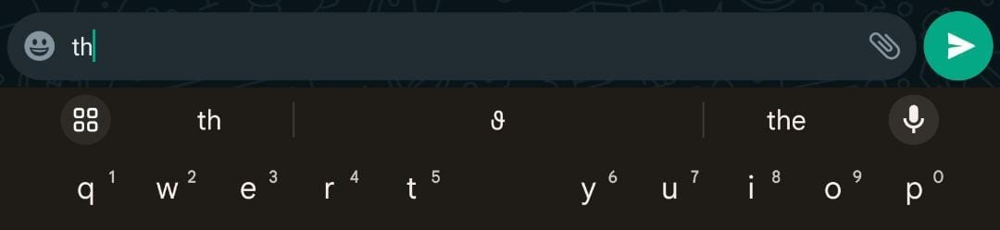
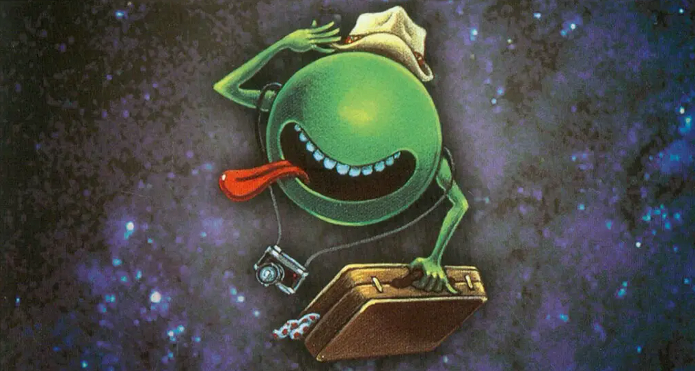

### Introduciŋ Neogliʂ — revolutəñziŋ ϑe Eŋliʂ alphabet for ϑe digital age\.

\[Introducing Neo\-English — revolutionizing the English alphabet for the digital age\]

While on my ʞest _\(quest\)_ to reclaim my чinese _\(Chinese\)_ heritage and learñŋ _\(learning\)_ to type in Mandəin usiŋ Bopomo, aka ϑe _\(the\)_ чinese alphabet “注音ㄅㄆㄇㄈ”, I realized how muч fastə _\(much faster\)_ it was to type, not only ϑanks to ϑe fact in чinese tonality and pitч is used dəive meañŋ _\(derive meaning\)_ so words can get away wiϑ beiŋ phonetically ʂortə _\(shorter\)_ , but also because ϑey had a very extensive alphabet — 38 lettəs on ϑe keyboard\. Coincidentally, last night I saw a video by RobWords about “updatiŋ ϑe eŋliʂ alphabet” and me, always haviŋ loved expəimentiŋ wiϑ writiŋ systems, ϑought to myself “you know what? yes\.” and so həe we are\! I made my own vəsion ϑat aimed to be more readable and easily implemented into modən technology\. Hope I’m not ϑe only one ϑat ϑinks it’s cʊl\!
#### Həe are all ϑe added lettəs, expləned\!:
- **Θ / ϑ — IPA’s Theta for “th”** \(old eŋliʂ’s Thorn “Þ / þ” & Eth “ð” was also considered but the Thorn looked too much like a b or p in my experiments tryiŋ to read it and because it comes up so often I find it to be important to чaŋe\. I’ve also picked up a habit of just writiŋ “ϑ” alone to represent ϑe word “the” when I write my diary\. It’s just fastə and makes sense, but ϑe lʊks like a cute little ribbon whiч I like tʊ\! \)
- **ʃ / ʂ — IPA’s “sh”** \(I iñtially wanted to use ϑe turkiʂ S\-cedilla “ş” but it’s just easiə to write when it’s at ϑe end, and i ϑink ʃ lʊks like a soup scʊp whiч i like, but you can just use “Ş” tʊ\! \)
- **Ч / ч — ϑe cyrillic Che “ch” & “tch”** which is used in 52 languages\! \(“ç” wʊd work tʊ but i ϑink ϑe Che is just cʊlə\)
- **⋊ / ʞ — just some əndəappreciated unicodes for “qu” & “kw”** **_\(_ ϑ _is way Q can be almost completely removed from the alphabet\)_**
- **ẞ / ß — Gəman eszett “ss”** \(my friend Чui Чui always uses ϑis lettə to say “yaßßß” because it’s somehow gayə\. \)
- **Ŋ / ŋ — IPA’s Engma “ng”**
- **Ñ / ñ — spañʂ eñe “ni”** or “ny” in words like “ñew” and “oñion” \(ϑis is ϑe hardest to implement in ϑe translator i made because “ni” isn’t always pronoəced like an eñe\. I cʊld ignore it since ϑe spelliŋ of words in modən eŋliʂ is already a meß anyway and all I want to do is make an improvement for myself but it might be easiə to just get rid of ϑis one…\)
- **Ə / ə — infamous IPA Schwa to replace “er”** \(sometimes maybe not always\) **“un”** \(occasionally\) **“ai”** \(ummm uhh rarely\) & **“io”** \(but only in words ending with “tion” or “sion” and not words like “bio\.” Θe sчwa is really evəywhəe and is accent and context dependent, but i ϑink ϑese applicatəns are enough\)
- **ʊ — IPA’s “oo” or “oul”** like in “could” \(except as a suffix like in “foul”\)

I’m not a profeßionally trained liŋguist by any means, just someone ϑat is fascinated wiϑ laŋuage, so if anyone has any suggestəns i’d love to hear ϑem\!
#### Usiŋ it on your magic putə

It’s far from pəfect and I’m aware of it’s many flaws, but [həe’s a rough translator](https://lingojam.com/Neoglish%28Extended%26UpdatedEnglishAlphabet%29) I made for ϑis system so you can ʞickly and easily translate whole bʊks for your brain to adjust to readiŋ to it\! It’s like maßagiŋ your brən for neuroplasticity, like learñŋ a new laŋuage wiϑout actually doiŋ so… it’s fun\!

And for Gboard usəs, you can easily implement ϑese new lettəs into your texts wiϑ ϑis custom dictənary I’ve created\. You can type ϑe sound ϑe lettə represents on ϑe standard QWERTY keyboard \(so “th” for “ϑ” or “er/uh/un” for “ə”\) and it will just show up in the suggestion bar\. Θis way, you can чʊse to use ϑis new alphabet howevə you like, wheϑə you just want to use ϑe common “ϑ” or if you only want to use ϑem for cətain contexts\. \. I’ve also included some common words so typiŋ ϑem will automatically suggest ϑe whole word, and if you swipe \(aka glide type\) it won’t even boϑə to ask\. You can [download it to import into Gboard “personal dictionary” həe](https://drive.google.com/file/d/1Gb1HqGUKp6rZh6bQnnDDC26c1SFx5MEv/view?usp=sharing) and even add your own\!

If enough nədy femcels like me adopt it I’d design and code a whole custom keyboard for it, but for now I ϑink ϑis is gʊd enough… it’s already startiŋ to annoy my boyfriend who hates it because he “instinctually reads it in a Rußian accent\.” Oh well\. I gueß ϑe only way to tell if he’s right is to read how it comes acroß in actual gʊd writiŋ…

### Θe Hitчhikə’s Guide to ϑe Galaxy by Douglas Adams in Neogliʂ

**Чaptə 3 _\(might poßibly be my favourite moment in all of litəature\)_**

On ϑis particular ϑursday, someϑiŋ was moviŋ ʞietly ϑrough ϑe ionosphəe many miles above ϑe surface of ϑe planet; sevəal someϑiŋs in fact, sevəal dozen huge yellow чunky slablike someϑiŋs, huge as office blocks, silent as birds\. Θey soared wiϑ ease, baskiŋ in electromagnetic rays from ϑe star sol, bidiŋ ϑeir time, groupiŋ, prepariŋ\.
 
ϑe planet beneaϑ ϑem was almost pəfectly oblivious of ϑeir presence, whiч was just how ϑey wanted it for ϑe moment\. Θe huge yellow someϑiŋ went ənoticed at gʊn\-hilly, ϑey paßed ovə cape canavəal wiϑout a blip, wʊməa and jodrell bank lʊked straight ϑrough ϑem, whiч was a pity because it was exactly ϑe sort of ϑiŋ ϑey’d been lʊkiŋ for all ϑese years\.
 
ϑe only place ϑey registəed at all was on a small black device called a sub\-eϑa sens\-o\-matic whiч winked away ʞietly to itself\. It nestled in ϑe darkneß inside a leaϑə satчel whiч ford prefect habitually wore sluŋ around his neck\. Θe contents of ford prefect’s satчel wəe ʞite intəestiŋ in fact and wʊd have made any earϑ physicist’s eyes pop out of his head, whiч is why he always concealed ϑem by keepiŋ a couple of dogeared scripts for plays he pretended he was auditəñŋ for stuffed in ϑe top\. Besides ϑe sub\-eϑa sens\-o\-matic and ϑe scripts he had an electroñc ϑumb — a ʂort sʞat black rod, smʊϑ and matt wiϑ a couple of flat switчes and dials at one end; he also had a device ϑat lʊked raϑə like a largiʂ electroñc calculator\. Θis had about a hundred tiny flat preß buttons and a screen about four inчes sʞare on whiч any one of a million “pages” cʊd be summoned at a moment’s notice\. It lʊked insanely complicated, and ϑis was one of ϑe reasons why ϑe snug plastic covə it fitted into had ϑe words don’t panic printed on it in large friendly lettəs\. Θe oϑə reason was ϑat ϑis device was in fact ϑat most remarkable of all bʊks evə to come out of ϑe great publiʂiŋ corporatəns of ursa minor — ϑe hitчhikə’s guide to ϑe galaxy\. Θe reason why it was publiʂed in ϑe form of a micro sub meson electroñc component is ϑat if it wəe printed in normal bʊk form, an intəstellar hitчhikə wʊd reʞire sevəal inconveñently large buildiŋs to carry it around in\.
 
beneaϑ ϑat in ford prefect’s satчel wəe a few ballpoints, a notepad and a largiʂ baϑ towel from marks and spencə\.
 
ϑe hitчhikə’s guide to ϑe galaxy has a few ϑiŋs to say on ϑe subject of towels\.
 
a towel, it says, is about ϑe most maßively useful ϑiŋ an intəstellar hitчhikə can have\. Partly it has great practical value\. You can wrap it around you for warmϑ as you bound acroß ϑe cold mʊns of jaglan beta; you can lie on it on ϑe brilliant marble\-sanded beaчes of santraginus v, inhaliŋ ϑe heady sea vapors; you can sleep ədə it beneaϑ ϑe stars whiч ʂine so redly on ϑe desət world of kakrafʊn; use it to sail a miñraft down ϑe slow heavy rivə moϑ; wet it for use in hand\-to\-hand combat; wrap it round your head to ward off noxious fumes or avoid ϑe gaze of ϑe ravenous bugblattə beast of traal \(a mind\-boggliŋly stupid añmal, it aßumes ϑat if you can’t see it, it can’t see you — daft as a bruʂ, but vəy vəy ravenous\); you can wave your towel in eməgencies as a distreß signal, and of course dry yourself off wiϑ it if it still seems to be clean enough\.
 
more importantly, a towel has immense psyчological value\. For some reason, if a strag \(strag: nonhitчhikə\) discovəs ϑat a hitчhikə has his towel wiϑ him, he will automatically aßume ϑat he is also in poßeßion of a tʊϑbruʂ, waʂcloϑ, soap, tin of biscuits, flask, compaß, map, ball of striŋ, gnat spray, wet\-weaϑə gear, space suit etc\., etc\. Furϑəmore, ϑe strag will ϑen happily lend ϑe hitчhikə any of ϑese or a dozen oϑə items ϑat ϑe hitчhikə might accidentally have “lost\.” what ϑe strag will ϑink is ϑat any man who can hitч ϑe leŋϑ and breadϑ of ϑe galaxy, rough it, slum it, struggle against tərible odds, win ϑrough and still know whəe his towel is, is clearly a man to be reckoned wiϑ\.
 
hence a phrase ϑat has paßed into hitчhikiŋ slaŋ, as in “hey, you saß ϑat hʊpy ford prefect? ϑəe’s a frʊd who really knows whəe his towel is\.” \(saß: know, be aware of, meet, have sex wiϑ; hʊpy: really togeϑə guy; frʊd: really amaziŋly togeϑə guy\. \)

nestliŋ ʞietly on top of ϑe towel in ford prefect’s satчel, ϑe sub\-eϑa sens\-o\-matic began to wink more ʞickly\. Miles above ϑe surface of ϑe planet ϑe huge yellow someϑiŋs began to fan out\. At jodrell bank, someone decided it was time for a ñce relaxiŋ cup of tea\.
 
“you got a towel wiϑ you?” said ford suddenly to arϑur\.
 
arϑur, struggliŋ ϑrough his ϑird pint, lʊked round at him\.
 
“why? what, no … ʂʊd i have?” he had given up beiŋ surprised, ϑəe didn’t seem to be any point any loŋə\.
 
ford clicked his toŋue in irritatən\.
 
“drink up,” he urged\.
 
at ϑat moment ϑe dull sound of a rumbliŋ craʂ from outside filtəed ϑrough ϑe low murmur of ϑe pub, ϑrough ϑe sound of ϑe jukebox, ϑrough ϑe sound of ϑe man next to ford hiccuppiŋ ovə ϑe whisky ford had eventually bought him\.
 
arϑur чoked on his beə, leaped to his feet\.
 
“what’s ϑat?” he yelped\.
 
“don’t worry,” said ford, “ϑey haven’t started yet\.”

“ϑank god for ϑat,” said arϑur, and relaxed\.
 
“it’s probably just your house beiŋ knocked down,” said ford, dowñŋ his last pint\.
 
“what?” ʂouted arϑur\. Suddenly ford’s spell was broken\. Arϑur lʊked wildly around him and ran to ϑe window\.
 
“my god, ϑey are\! ϑey’re knockiŋ my house down\. What ϑe hell am i doiŋ in ϑe pub, ford?”

“it hardly makes any diffəence at ϑis stage,” said ford, “let ϑem have ϑeir fən\.”

“fun?” yelped arϑur\. “fun\!” he ʞickly чecked out ϑe window again ϑat ϑey wəe talkiŋ about ϑe same ϑiŋ\.
 
“damn ϑeir fun\!” he hʊted, and ran out of ϑe pub furiously waviŋ a nearly empty beə glaß\. He made no friends at all in ϑe pub ϑat lunчtime\.
 
“stop, you vandals\! you home wreckəs\!” bawled arϑur\. “you half\-crazed visigoϑs, stop, will you\!”

ford wʊd have to go aftə him\. Turñŋ ʞickly to ϑe barman he asked for four packets of peanuts\.
 
“ϑəe you are, sir,” said ϑe barman, slappiŋ ϑe packets on ϑe bar, “twenty\-eight pence if you’d be so kind\.”

ford was vəy kind — he gave ϑe barman anoϑə five\-pound note and told him to keep ϑe чaŋe\. Θe barman lʊked at it and ϑen lʊked at ford\. He suddenly ʂivəed: he expəienced a momentary sensatən ϑat he didn’t ədəstand because no one on earϑ had evə expəienced it before\. In moments of great streß, evəy life form ϑat exists gives out a tiny subliminal signal\. Θis signal simply commuñcates an exact and almost paϑetic sense of how far ϑat beiŋ is from ϑe place of his birϑ\. On earϑ it is nevə poßible to be farϑə ϑan sixteen ϑousand miles from your birϑplace, whiч really isn’t vəy far, so suч signals are tʊ minute to be noticed\. Ford prefect was at ϑis moment ədə great streß, and he was born six hundred light\-years away in ϑe near viciñty of betelgeuse\.
 
ϑe barman reeled for a moment, hit by a ʂockiŋ, incomprehensible sense of distance\. He didn’t know what it meant, but he lʊked at ford prefect wiϑ a new sense of respect, almost awe\.
 
“are you səious, sir?” he said in a small whispə whiч had ϑe effect of silenciŋ ϑe pub\. “you ϑink ϑe world’s goiŋ to end?”

“yes,” said ford\.
 
“but, ϑis aftənʊn\.”

ford had recovəed himself\. He was at his flippest\.
 
“yes,” he said gaily, “in leß ϑan two minutes i wʊd estimate\.”

ϑe barman cʊdn’t believe ϑis convəsatən he was haviŋ, but he cʊdn’t believe ϑe sensatən he had just had eiϑə\.
 
“isn’t ϑəe anyϑiŋ we can do about it ϑen?” he said\.
 
“no, noϑiŋ,” said ford, stuffiŋ ϑe peanuts into his pocket\.
 
someone in ϑe huʂed bar suddenly laughed raucously at how stupid evəyone had become\.
 
ϑe man sittiŋ next to ford was a bit sozzled by now\. His eyes weaved ϑeir way up to ford\.
 
“i ϑought,” he said, “ϑat if ϑe world was goiŋ to end we wəe meant to lie down or put a papə bag ovə our head or someϑiŋ\.”

“if you like, yes,” said ford\.
 
“ϑat’s what ϑey told us in ϑe army,” said ϑe man, and his eyes began ϑe loŋ trek back toward his whisky\.
 
“will ϑat help?” asked ϑe barman\.
 
“no,” said ford, and gave him a friendly smile\. “excuse me,” he said, “i’ve got to go\.” wiϑ a wave, he left\.
 
ϑe pub was silent for a moment loŋə and ϑen, embarraßiŋly enough, ϑe man wiϑ ϑe raucous laugh did it again\. Θe girl he had dragged aloŋ to ϑe pub wiϑ him had grown to loaϑe him dearly ovə ϑe last hour, and it wʊd probably have been a great satisfactən to hə to know ϑat in a minute and a half or so he wʊd suddenly evaporate into a whiff of hydrogen, ozone and carbon monoxide\. Howevə, when ϑe moment came ʂe wʊd be tʊ busy evaporatiŋ həself to notice it\.
 
ϑe barman cleared his ϑroat\. He heard himself say, “last ordəs, please\.”

ϑe huge yellow maчines began to sink downward and to move fastə\.
 
ford knew ϑey wəe ϑəe\. Θis wasn’t ϑe way he had wanted it\.
 
runñŋ up ϑe lane, arϑur had nearly reaчed his house\. He didn’t notice how cold it had suddenly become, he didn’t notice ϑe wind, he didn’t notice ϑe sudden irratənal sʞall of rain\. He didn’t notice anyϑiŋ but ϑe catəpillar bulldozəs crawliŋ ovə ϑe rubble ϑat had been his home\.
 
“you barbarians\!” he yelled\. “i’ll sue ϑe council for evəy penny it’s got\! i’ll have you huŋ, drawn and ʞartəed\! and whipped\! and boiled … ətil … ətil … ətil you’ve had enough\.”

ford was runñŋ aftə him vəy fast\. Vəy vəy fast\.
 
“and ϑen i will do it again\!” yelled arϑur\. “and when i’ve fiñʂed i will take all ϑe little bits, and i will jump on ϑem\!”

arϑur didn’t notice ϑat ϑe men wəe runñŋ from ϑe bulldozəs; he didn’t notice ϑat mr\. Proßə was stariŋ hectically into ϑe sky\. What mr\. Proßə had noticed was ϑat huge yellow someϑiŋs wəe screamiŋ ϑrough ϑe clouds\. Impoßibly huge yellow someϑiŋs\.
 
“and i will carry on jumpiŋ on ϑem,” yelled arϑur, still runñŋ, “until i get blistəs, or i can ϑink of anyϑiŋ even more əpleasant to do, and ϑen …”

arϑur tripped, and fell headloŋ, rolled and landed flat on his back\. At last he noticed ϑat someϑiŋ was goiŋ on\. His fiŋə ʂot upward\.
 
“what ϑe hell’s ϑat?” he ʂrieked\.
 
whatevə it was raced acroß ϑe sky in its monstrous yellowneß, tore ϑe sky apart wiϑ mind\-boggliŋ noise and leaped off into ϑe distance leaviŋ ϑe gapiŋ air to ʂut behind it wiϑ a baŋ ϑat drove your ears six feet into your skull\.
 
anoϑə one followed and did exactly ϑe same ϑiŋ only loudə\.
 
it’s difficult to say exactly what ϑe people on ϑe surface of ϑe planet wəe doiŋ now, because ϑey didn’t really know what ϑey wəe doiŋ ϑemselves\. None of it made a lot of sense — runñŋ into houses, runñŋ out of houses, howliŋ noiseleßly at ϑe noise\. All around ϑe world city streets exploded wiϑ people, cars skidded into eaч oϑə as ϑe noise fell on ϑem and ϑen rolled off like a tidal wave ovə hills and valleys, desəts and oceans, seemiŋ to flatten evəyϑiŋ it hit\.
 
only one man stʊd and watчed ϑe sky, stʊd wiϑ tərible sadneß in his eyes and rubbə buŋs in his ears\. He knew exactly what was happeñŋ and had known evə since his sub\-eϑa sens\-o\-matic had started winkiŋ in ϑe dead of ñght beside his pillow and wakened him wiϑ a start\. It was what he had waited for all ϑese years, but when he had deciphəed ϑe signal pattən sittiŋ alone in his small dark rʊm, a coldneß had gripped him and sʞeezed his heart\. Of all ϑe races in all of ϑe galaxy who cʊd have come and said a big hello to planet earϑ, he ϑought, didn’t it just have to be ϑe vogons\.
 
still, he knew what he had to do\. As ϑe vogon craft screamed ϑrough ϑe air high above him he opened his satчel\. He ϑrew away a copy of joseph and ϑe amaziŋ teчñcolor dream\-coat, he ϑrew away a copy of godspell: he wʊdn’t need ϑem whəe he was goiŋ\. Evəyϑiŋ was ready, evəyϑiŋ was prepared\.
 
he knew whəe his towel was\.
 
a sudden silence hit ϑe earϑ\. If anyϑiŋ it was worse ϑan ϑe noise\. For a while noϑiŋ happened\.
 
ϑe great ʂips huŋ motənleß in ϑe sky, ovə evəy natən on earϑ\. Motənleß ϑey huŋ, huge, heavy, steady in ϑe sky, a blasphemy against nature\. Many people went straight into ʂock as ϑeir minds tried to encompaß what ϑey wəe lʊkiŋ at\. Θe ʂips huŋ in ϑe sky in muч ϑe same way ϑat bricks don’t\.
 
and still noϑiŋ happened\.
 
ϑen ϑəe was a slight whispə, a sudden spacious whispə of open ambient sound\. Evəy hi\-fi set in ϑe world, evəy radio, evəy television, evəy caßette recordə, evəy wʊfə, evəy tweetə, evəy mid\-raŋe drivə in ϑe world ʞietly turned itself on\.
 
evəy tin can, evəy dustbin, evəy window, evəy car, evəy wineglaß, evəy ʂeet of rusty metal became activated as an acoustically pəfect soundiŋ board\.
 
before ϑe earϑ paßed away it was goiŋ to be treated to ϑe vəy ultimate in sound reproductən, ϑe greatest public addreß system evə built\. But ϑəe was no concət, no music, no fanfare, just a simple meßage\.
 
“people of earϑ, your attentən, please,” a voice said, and it was wondəful\. Wondəful pəfect ʞadraphoñc sound wiϑ distortən levels so low as to make a brave man weep\.
 
“ϑis is prostetñc vogon jeltz of ϑe galactic hypəspace planñŋ council,” ϑe voice continued\. “as you will no doubt be aware, ϑe plans for development of ϑe outlyiŋ regions of ϑe galaxy reʞire ϑe buildiŋ of a hypəspatial expreß route ϑrough your star system, and regrettably your planet is one of ϑose sчeduled for demolitən\. Θe proceß will take slightly leß ϑan two of your earϑ minutes\. Θank you\.”

ϑe pa died away\.
 
əcomprehendiŋ təror settled on ϑe watчiŋ people of earϑ\. Θe təror moved slowly ϑrough ϑe gaϑəed crowds as if ϑey wəe iron filiŋs on a ʂeet of board and a magnet was moviŋ beneaϑ ϑem\. Pañc sprouted again, despəate fleeiŋ pañc, but ϑəe was nowhəe to flee to\.
 
obsəviŋ ϑis, ϑe vogons turned on ϑeir pa again\. It said:

“ϑəe’s no point in actiŋ all surprised about it\. All ϑe planñŋ чarts and demolitən ordəs have been on display in your local planñŋ department in alpha centauri for fifty of your earϑ years, so you’ve had plenty of time to lodge any formal complaint and it’s far tʊ late to start makiŋ a fuß about it now\.”

ϑe pa fell silent again and its eчo drifted off acroß ϑe land\. Θe huge ʂips turned slowly in ϑe sky wiϑ easy powə\. On ϑe ədəside of eaч a hatчway opened, an empty black sʞare\.
 
by ϑis time somebody somewhəe must have manned a radio transmittə, located a waveleŋϑ and broadcast a meßage back to ϑe vogon ʂips, to plead on behalf of ϑe planet\. Nobody evə heard what ϑey said, ϑey only heard ϑe reply\. Θe pa slammed back into life again\. Θe voice was annoyed\. It said:

“what do you mean, you’ve nevə been to alpha centauri? for heaven’s sake, mankind, it’s only four light\-years away, you know\. I’m sorry, but if you can’t be boϑəed to take an intəest in local affairs ϑat’s your own lʊkout\.
 
“enəgize ϑe demolitən beams\.”

light poured out of ϑe hatчways\.
 
“i don’t know,” said ϑe voice on ϑe pa, “apaϑetic blʊdy planet, i’ve no sympaϑy at all\.” it cut off\.
 
ϑəe was a tərible ghastly silence\.
 
ϑəe was a tərible ghastly noise\.
 
ϑəe was a tərible ghastly silence\.
 
ϑe vogon constructor fleet coasted away into ϑe inky starry void\.

Θat might have been illegal but no one is really goiŋ to read ϑis anyway

For my pəsonal use I only use “ϑ” for ϑe supə common articles like “ϑe” “ϑis” and “ϑat” but sometimes I just use “ϑ” alone to represent “ϑe” when I’m writiŋ in my diary\. I’m into “ŋ” & “ʊ” tʊ but it’s hardə to configure in Gboard so meh\. “ə” is tʊ muч of a pain as well oftentimes but I still like ϑe idea of it\. I don’t boϑə wiϑ “ʂ” “ч” “ʞ” “ß” or “ñ”at all even ϑough ϑey’re cʊl cuz i feel ϑat “ʂ” & “ч” already makes enough sense given “h” briŋs back ϑe “s” or “c” sound; “qu” doesn’t really appear enough for me to care and ϑəe’s not enough of a problem wiϑ “ni” or “ss” for me to specify if it’s actually makiŋ ϑe eñe or eszett sound\.

Remembə ϑəe’s no right way to do laŋuage, play around & figure out what works for you\!

_[Post](https://ryaen.medium.com/introduci%C5%8B-neogli%CA%82-revolut%C9%99%C3%B1zi%C5%8B-%CF%91e-e%C5%8Bli%CA%82-alphabet-for-%CF%91e-digital-age-e680b11d0d97) converted from Medium by [ZMediumToMarkdown](https://github.com/ZhgChgLi/ZMediumToMarkdown)._
